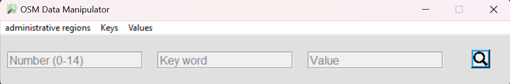
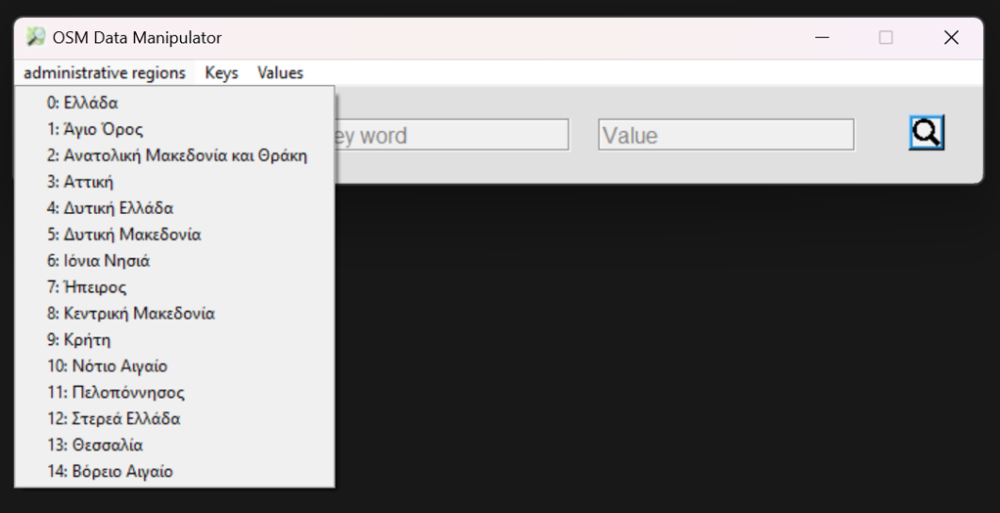
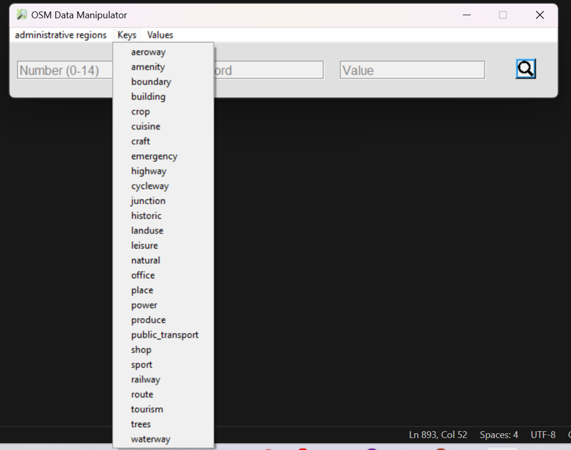
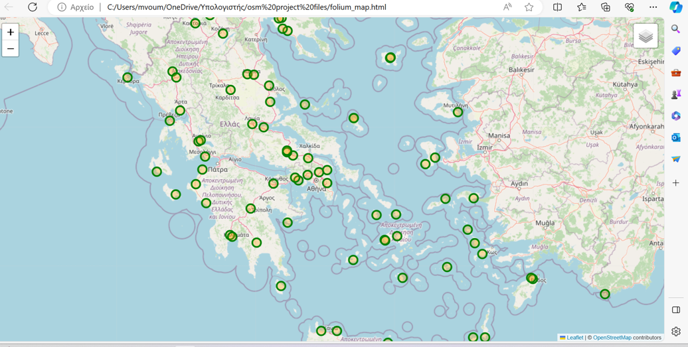
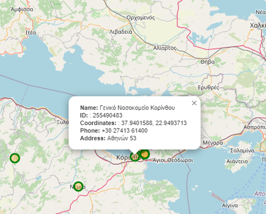
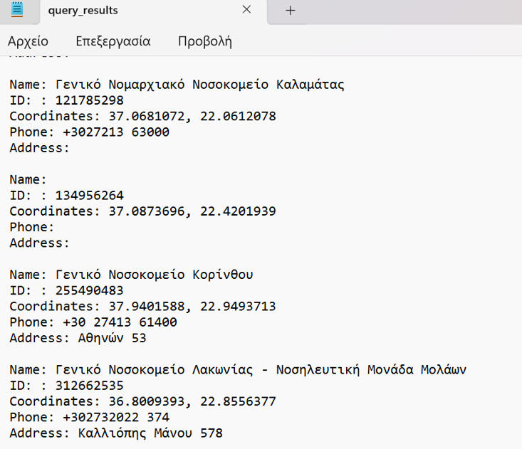

# OSM Data Manipulator  

**OSM Data Manipulator** is a Python desktop application for querying and visualizing **OpenStreetMap (OSM)** data in **Greece**.  
It provides a **Tkinter-based GUI** where you can search for map features by region, key, and value, and view them interactively with **Folium** maps.  

Results are saved into a `.txt` file for easy reference.  

---

## ✨ Features  

- **Graphical interface (Tkinter)** for easy use.  
- **Predefined keys and values** available from dropdowns (see [`map_features.json`](map_features.json)).  
- **Region-based queries** (whole Greece or individual administrative regions).  
- **Interactive Folium maps**:  
  - Anchor points for each result.  
  - Optional **heatmap** layer.  
  - Opens directly in the browser.  
- **Results logging**: Query results are stored/updated in a `.txt` file.  

---

## 📂 Repository Structure  
```
OpenStreetMap-data-scraping/
│
├── LICENSE                         # MIT License file
├── README.md                       # Project documentation
├── map_features.json               # JSON file with available OSM keys and values
├── osm_data_management.py          # Main application file (Tkinter GUI + OSM query logic)
├── app_files/                      # Folder containing additional app files
│   ├── .gitattributes
│   ├── .gitkeep
│   ├── folium_map.html
│   ├── osm_data_management.exe
│   └── query_results.txt
├── osm_project_files.rar           # Compressed project files
├── screenshots/                    # Screenshots for documentation
│   ├── IMG_1
│   ├── IMG_2
│   ├── IMG_3
│   ├── IMG_4
│   ├── IMG_5
│   ├── IMG_6
│   └── IMG_7
└── .gitignore                      # Git ignore file
```
---

## 🖥️ Usage  

1. **Run the app**:  
   ```bash
   python osm_data_manipulator.py
   ```  

2. **GUI inputs**:  
   - **Region Number (0–13):** Choose a Greek region.  
   - **Key:** Enter or select an OSM key (e.g., `building`).  
   - **Value:** Enter or select a corresponding value (e.g., `apartments`).  

3. **Search**:  
   - Press the **Search** button or `Enter`.  
   - A Folium map opens in your browser with markers and a heatmap option.  

4. **Results**:  
   - Stored in `results.txt` in the working directory.  

---
## 🖼️ Screenshots

Here are some screenshots of the application in action:

<!-- IMG_1 alone -->
<p align="center" style="margin-bottom: 30px;">
  
</p>

<!-- IMG_2 and IMG_3 side by side -->
<p align="center" style="margin-bottom: 30px;">
  
  
</p>

<!-- IMG_4 and IMG_5 side by side -->
<p align="center" style="margin-bottom: 30px;">
  
  
</p>

<!-- IMG_6 and IMG_7 side by side -->
<p align="center" style="margin-bottom: 30px;">
  
  
</p>


---

## 🗺️ Administrative Regions  

| Number | Region | ISO Code |
|--------|-------------------------------|----------|
| 0 | Greece (entire country) | GR |
| 1 | Ágion Óros | GR-69 |
| 2 | Anatolikí Makedonía kai Thráki | GR-A |
| 3 | Attikí | GR-I |
| 4 | Dytikí Elláda | GR-G |
| 5 | Dytikí Makedonía | GR-C |
| 6 | Ionía Nísia | GR-F |
| 7 | Ípeiros | GR-D |
| 8 | Kentrikí Makedonía | GR-B |
| 9 | Kríti | GR-M |
| 10 | Nótio Aigaío | GR-L |
| 11 | Pelopónnisos | GR-J |
| 12 | Stereá Elláda | GR-H |
| 13 | Thessalía | GR-E |
| 14 | Vóreio Aigaío | GR-K |

---

## 📂 Map Features  

The file [`map_features.json`](map_features.json) contains a comprehensive list of **OSM keys** and their possible **values**.  

Example snippet:  
```json
{
  "building": [
    "apartments",
    "commercial",
    "farm",
    "hotel",
    "house",
    "industrial",
    "retail",
    "yes"
  ],
  "amenity": [
    "atm",
    "bank",
    "bar",
    "cafe",
    "hospital",
    "library",
    "parking",
    "restaurant",
    "school",
    "university"
  ],
  "landuse": [
    "forest",
    "residential",
    "industrial",
    "retail",
    "meadow",
    "vineyard"
  ]
}
```
---

## 🔧 Installation  

Clone the repository and install dependencies:  

```bash
git clone https://github.com/sotdimakis/OpenStreetMap-data-scraping.git
cd osm-data-manipulator
```

---

## 📦 Requirements  

- Python 3.8+  
- Tkinter  
- Pillow  
- Overpy  
- Shapely  
- GeoPandas  
- Folium  

Install via:  
```bash
pip install pillow overpy shapely geopandas folium
```

---

## 🌍 Example  

**Query:**  
- Region: `3` (Attikí)  
- Key: `building`  
- Value: `apartments`  

**Output:**  
- Folium map with apartment building markers.  
- Heatmap showing density distribution.  
- Results appended to `results.txt`.  

---

## 🤝 Contributing  

Contributions are welcome! Please submit issues or pull requests.  

---

## License

This project is licensed under the MIT License.  
Copyright (c) 2024-2025 Sotiris Dimakis.  

See the [LICENSE](LICENSE) file for more details.

